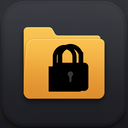

# SecretFolder

**Encrypted folder vault for Windows** — the feel of a local file explorer, with **secrets safe at rest**.

Use it for recovery codes, exports, screenshots of secrets, notes, and anything you would not trust to a plain folder or synced drive.

[](https://github.com/AhmiDarrow/SecretFolder/actions/workflows/ci.yml)
[](LICENSE)
[](https://github.com/AhmiDarrow/SecretFolder/releases)

<p align="center">
  
</p>

<p align="center">
  <strong>Local-only · Master password · Folders + explorer · System tray</strong>
</p>

---

## Why

Plain folders and cloud drives are great for everyday files and terrible for secrets (readable on disk, backup sprawl, sync surface). **SecretFolder** keeps a familiar explorer UX and encrypts names and contents at rest.

Sibling product to [SecretSticky](https://github.com/AhmiDarrow/SecretSticky) (encrypted sticky notes): same crypto DNA and dark chrome, different job — **files**, not stickies. Separate app data, AAD namespace, identifier, and release channel; never share vaults or keys between the two.

## Features

| Area | Details |
|------|---------|
| **Vault** | Master password unlock; recovery key (shown once at setup) |
| **Crypto** | Argon2id (64 MiB, t=3) + XChaCha20-Poly1305 AEAD |
| **Keys** | Stable content key — change password without re-encrypting every blob or killing recovery |
| **Items** | Text notes, images, and binary files (v1 hard cap ~25 MiB per item) |
| **Names** | Filenames encrypted at rest |
| **Folders** | Nested groups, breadcrumbs, drag-move in-vault, drop OS files onto a folder |
| **Explorer** | List / search · text editor · image preview · import / export · multi-select |
| **Tray** | Show · Lock · Quit |
| **UX** | Close window → tray; Inter font (self-hosted); dark chrome + amber accent |
| **Clipboard** | Copy secrets with auto-clear (default 30s) |
| **Idle** | Auto-lock after inactivity (default 15 minutes) |
| **Updates** | Signed auto-update from GitHub Releases (About → Check for updates) |
| **About** | “Hi I'm Ahmi, hope this helps!” + profile / repo / releases / Patreon |

## Install

### Prebuilt (recommended)

Download the latest Windows installer from  
**[Releases](https://github.com/AhmiDarrow/SecretFolder/releases/latest)**  
(NSIS `.exe` setup; MSI when available).

The NSIS installer creates **Start Menu** and **Desktop** shortcuts that use the folder+lock icon (same mark as the taskbar and tray).

Installed builds can update themselves: **About → Check for updates** downloads the next signed release from GitHub and restarts the app.

### From source

```bash
git clone https://github.com/AhmiDarrow/SecretFolder.git
cd SecretFolder
npm install
npm run tauri:dev      # development
npm run tauri:build    # release installers under src-tauri/target/release/bundle/
```

**Requirements:** Windows 10/11, Node 20+, Rust stable, WebView2.

## Quick start

1. Launch SecretFolder → create a master password (12+ characters).
2. **Save the recovery key offline** (shown once). Lost password + lost recovery = permanent data loss.
3. Create folders, drop files in, or **New text**. Edit, preview images, export when needed.
4. Close the window with **X** → app stays in the tray. Tray → **Quit** to exit fully.
5. Tray → **Lock** when you step away.

## Data layout

```
%APPDATA%\com.ahmi.secretfolder\
  vault.json          # index + KDF params (encrypted names / metadata)
  blobs\              # encrypted item payloads
```

- **Encrypted:** item names, content blobs  
- **Plaintext by design:** structural ids, kind, sizes, timestamps needed to list chrome without decrypting every payload early  

Atomic replace on save (temp file + replace) so a crash mid-write is less likely to corrupt the vault.

## Security model

### Protects

- Vault files at rest (disk theft, backups, casual snooping)
- Authenticated encryption of item names and contents
- Idle lock + clipboard auto-clear for common desk-walk mistakes

### Does **not** protect

- Malware / keyloggers while unlocked  
- Screen capture of open previews/editors  
- A compromised OS or attached debugger  

There is **no cloud sync**, **no account**, and **no backdoor** for vault data.  
**Network use is limited to signed app updates** from GitHub Releases.

See [SECURITY.md](SECURITY.md) for the full threat model and vulnerability reporting.

## Development

```bash
npm install
npm run tauri:dev

# Tests
npm test              # TypeScript check + Vitest
npm run test:rust     # Rust crypto / vault
npm run test:all      # both
npm run build         # Vite production bundle only
```

| Path | Role |
|------|------|
| `src/` | React UI (unlock, explorer, about) |
| `src-tauri/src/crypto.rs` | KDF + AEAD |
| `src-tauri/src/vault.rs` | On-disk format + session |
| `src-tauri/src/commands.rs` | Tauri IPC, tray, dialogs |
| `.github/workflows/` | CI + tag release builds |

## CI & releases

- **CI** (`.github/workflows/ci.yml`) — on push/PR to `main`: frontend tests + Vite build, Rust fmt + tests (Windows).
- **Release** (`.github/workflows/release.yml`) — on tag `v*` (or manual dispatch): test gate, then signed Tauri NSIS/MSI + updater `latest.json`, draft GitHub Release.

```bash
# After bumping version in package.json, Cargo.toml, tauri.conf.json + CHANGELOG
git tag v<version>
git push origin v<version>
```

Requires repo secret `TAURI_SIGNING_PRIVATE_KEY` (see CONTRIBUTING).

## Stack

- **Tauri 2** + **React 19** + **TypeScript** + **Vite**
- **Rust:** `argon2`, `chacha20poly1305`, `zeroize`, `serde`
- **Font:** Inter via `@fontsource/inter` (self-hosted WOFF2, no CDN)
- **Updates:** `tauri-plugin-updater` + `tauri-plugin-process` (signed GitHub Releases)

## Auto-update

Release builds ship with the Tauri updater plugin:

1. CI signs NSIS/MSI updater artifacts with a minisign key (`TAURI_SIGNING_PRIVATE_KEY` repo secret).
2. Each release publishes `latest.json` next to the installers.
3. The app polls `…/releases/latest/download/latest.json`, verifies the signature with the **public** key embedded in the binary, then installs (About → Check for updates).

Dev (`tauri dev`) has no installer channel — use a packaged build to exercise updates.

Vault data never leaves the machine; only update checks hit GitHub.

## About

Hi I'm Ahmi, hope this helps!

- GitHub: [github.com/AhmiDarrow](https://github.com/AhmiDarrow)
- This project: [AhmiDarrow/SecretFolder](https://github.com/AhmiDarrow/SecretFolder)
- Sibling: [AhmiDarrow/SecretSticky](https://github.com/AhmiDarrow/SecretSticky)
- Releases: [github.com/AhmiDarrow/SecretFolder/releases](https://github.com/AhmiDarrow/SecretFolder/releases)
- Support: [patreon.com/cw/AhmiDarrow](https://www.patreon.com/cw/AhmiDarrow) — thank you!

SecretFolder is a small, local-first Windows app for people who need a real at-rest vault for files — text, images, and small binaries — without cloud accounts. Built with Tauri so the UI stays light and the crypto stays in Rust.

## License

[MIT](LICENSE) © Ahmi Darrow
